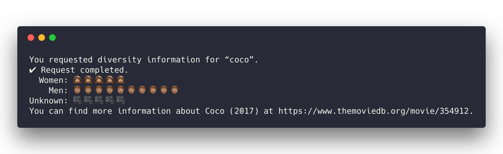

# [Movie Gender Diversity CLI](https://github.com/jmahabal/movie-diversity-cli)

This is a CLI tool for determining the breakdown by gender of various movies. I
grab the data from [the Movie DB](themoviedb.org), a website similar to IMDB but
with an API.

# How to use it

First, install the application from npm:

`npm install movie-diversity-cli -g`
Then to actually use the script,
`movie-diversity "movie name"`

Here's an example response you might get:

# How it works

The process of creating an 'analysis' kicks off with a movie title. This title
is fed into the MovieDB search API after which the bot selects the first movie
listed. Once there is a movie associated with the request, the program grabs the
cast members and aggregates the genders of the first 20 cast members. The cast
members are billed according to importance, so choosing the top 20 should lead
to a accurate study, as minor characters with little screen time are not as
relevant (though definitely still important!) The output distribution is then
displayed to the user.

This CLI makes a call to an Amazon Lambda function, which where the above
process runs. You can see code for that process under `lambda/`. 

# The future

* Expand analysis to include ethnicity information as well, in addition to other
  groups

# Credits

[The Movie DB](https://www.themoviedb.org/documentation/api)
